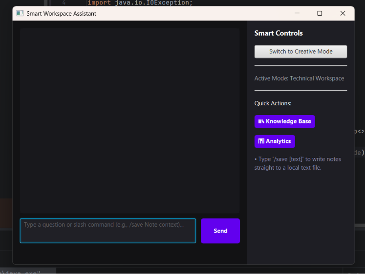
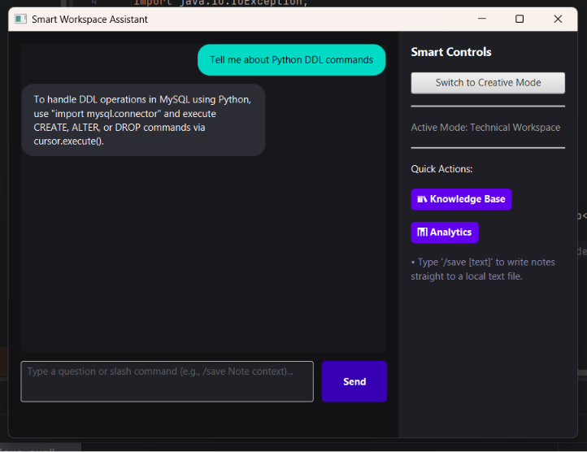
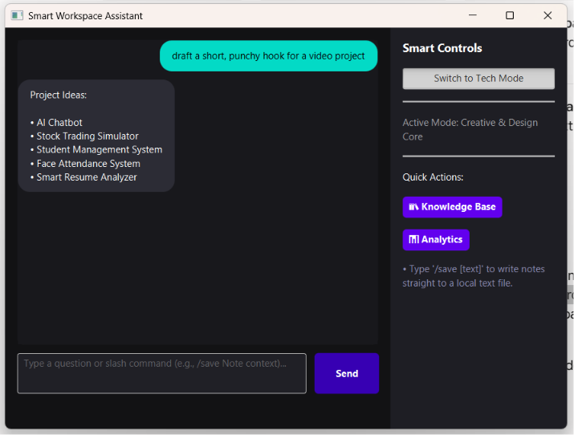
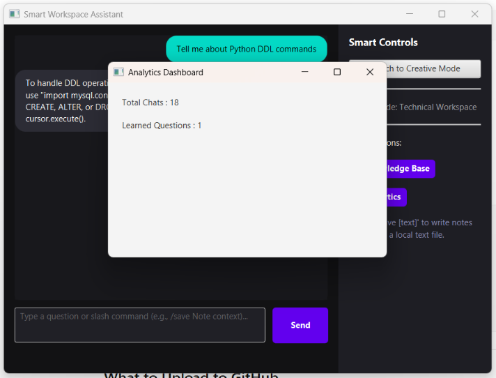
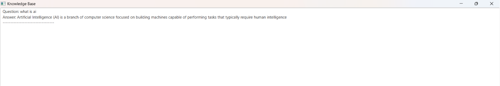
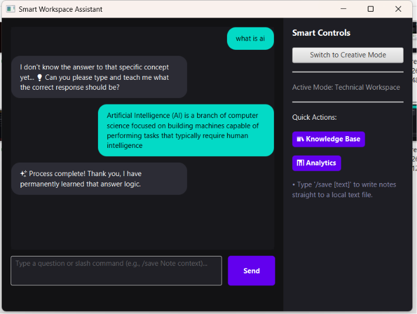
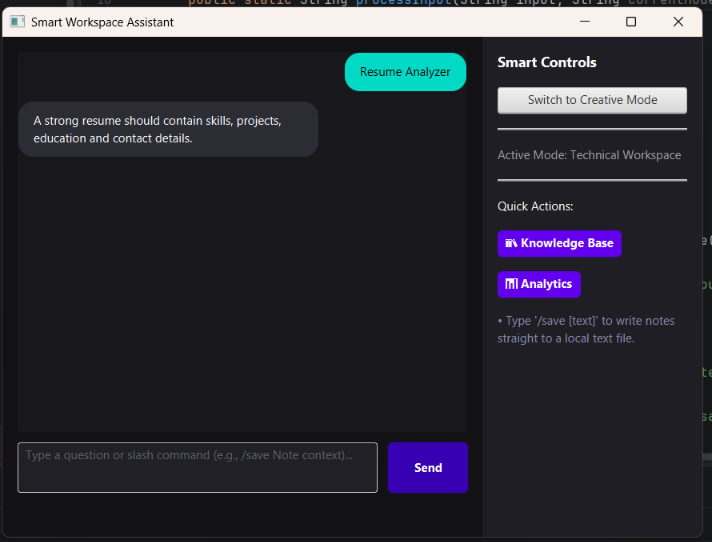

\# SmartChatBot

An AI-Powered Student Assistant built using JavaFX, MySQL, JDBC, and Maven.

SmartChatBot is a desktop-based intelligent assistant designed to help students with study planning, placement preparation, internship guidance, resume analysis, sentiment-based interaction, and self-learning chatbot capabilities. The application combines Artificial Intelligence concepts with database management and a modern JavaFX user interface.

---

## Features

### AI Features

* Self-Learning Chatbot
* Runtime Memory System
* Intent Detection
* Sentiment Analysis
* Knowledge Base Storage
* Dynamic Learning Capability

### Student Assistance Features

* Study Plan Generator
* Placement Preparation Guidance
* Internship Guidance
* Resume Analyzer
* Attendance Improvement Tips
* CGPA Improvement Suggestions
* Project Recommendations

### Database Features

* Chat History Storage
* Learned Knowledge Storage
* FAQ Database Integration
* Analytics Dashboard
* Persistent Data Management

### User Interface Features

* Modern JavaFX Interface
* Technical Mode
* Creative Mode
* Chat Bubble Design
* Analytics Dashboard
* Knowledge Base Viewer

---

## Technologies Used

| Technology | Purpose                   |
| ---------- | ------------------------- |
| Java       | Core Programming Language |
| JavaFX     | Desktop GUI Development   |
| MySQL      | Database Management       |
| JDBC       | Database Connectivity     |
| Maven      | Dependency Management     |
| CSS        | User Interface Styling    |

---

## Project Structure

SmartChatBot

├── src

│   └── main

│       ├── java

│       │   └── com

│       │       └── chatbot

│       │           ├── Main.java

│       │           ├── ChatController.java

│       │           ├── DatabaseManager.java

│       │           ├── NLPProcessor.java

│       │           ├── IntentDetector.java

│       │           └── StudyPlanner.java

│       │

│       └── resources

│           └── com

│               └── chatbot

│                   ├── chat-view.fxml

│                   └── styles.css

│

├── screenshots

│   ├── analytics.png

│   ├── creative-mode.png

│   ├── home.png

│   ├── knowledge.png

│   ├── learner.png

│   ├── resume-analyzer.png

│   └── technical-mode.png

│

├── database.sql

├── README.md

├── pom.xml

├── mvnw

├── mvnw.cmd

└── .gitignore

---

## Screenshots

### Home Interface



### Technical Mode



### Creative Mode



### Analytics Dashboard



### Knowledge Base



### Learner Feature



### Resume Analyzer



---

## Database Setup

### Create Database

```sql
CREATE DATABASE chatbot_db;
```

### Use Database

```sql
USE chatbot_db;
```

### Create FAQ Table

```sql
CREATE TABLE faq(
id INT AUTO_INCREMENT PRIMARY KEY,
keywords VARCHAR(255),
response TEXT
);
```

### Create Learned Data Table

```sql
CREATE TABLE learned_data(
question VARCHAR(255) PRIMARY KEY,
answer TEXT
);
```

### Create Chat History Table

```sql
CREATE TABLE chat_history(
id INT AUTO_INCREMENT PRIMARY KEY,
question TEXT,
answer TEXT
);
```

---

## Installation

### Clone Repository

```bash
git clone https://github.com/yourusername/SmartChatBot.git
```

### Open Project

Open the project using IntelliJ IDEA.

### Configure Database

Update database credentials inside:

```java
DatabaseManager.java
```

### Build Project

```bash
mvn clean install
```

### Run Project

```bash
mvn javafx:run
```

---

## Available Commands

### Help Command

```text
/help
```

Displays all available features.

### Show Chat History

```text
/showhistory
```

Displays recently stored conversations.

### Save Notes

```text
/save your_note_here
```

Stores notes into Workspace_Notes.txt.

### Resume Analysis

```text
/analyze_resume
```

Analyzes resume content and generates a score.

---

## Future Enhancements

* Voice Assistant Integration
* OpenAI API Integration
* Speech Recognition
* Dark/Light Theme Support
* PDF Resume Upload
* Export Chat History
* Advanced Analytics Graphs
* Cloud Database Support

---

## Learning Outcomes

This project helped in understanding:

* JavaFX Application Development
* Object-Oriented Programming
* JDBC Connectivity
* MySQL Database Management
* Artificial Intelligence Concepts
* Maven Project Management
* Desktop Application Development

---

## Author

Abhinaya Bandari

B.Tech Computer Science Engineering

---

## License

This project is licensed under the MIT License.

Feel free to use, modify, and distribute this project for educational purposes.
